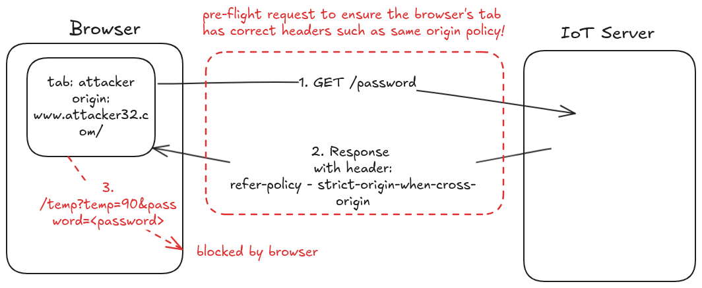
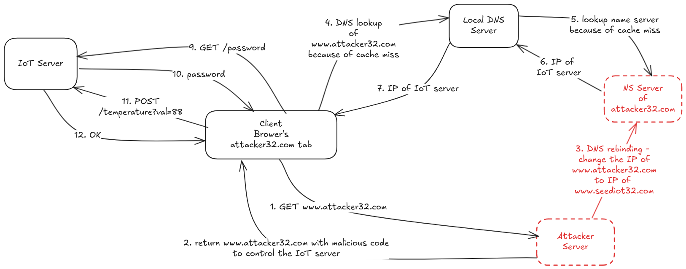

# DNS Rebinding Attack Lab

## Objectives

The objective of this lab is two-fold: (1) demonstrate how the DNS rebinding attack works, and (2) help students gain the first-hand experience on how to use the DNS rebinding technique to attack IoT devices. In the setup, we have a simulated IoT device, which can be controlled through a web interface (this is typical for many IoT devices). Many IoT devices do not have a strong protection mechanism, if attackers can directly interact with them, they can easily compromise these devices.

The IoT device simulated in this lab is a thermostat, which controls the room temperature. To successfully set the temperature, the client needs to be able to interact with the IoT server. Since the IoT device is behind the firewall, outside machines cannot interact with the IoT device, and will therefore not be able to control the thermostat. To defeat the firewall protection, the attacking code must get into the internal network first. This is not difficult. Any time when a user from the internal network visits the attacker’s website, the attacker’s code (JavaScript code) actually runs from the user’s browser, and therefore runs inside the protected internal network. However, due to the sandbox protection implemented by browsers, the attacker’s code still cannot interact with the IoT device, even though it is now inside the internal network. 

The objective of this lab is to use the DNS rebinding attack to circumvent the sandbox protection, so the JavaScript code from the attacker can successfully get the essential information from the IoT device and then use the information to set the temperature of the thermostat to a dangerously high value. This lab covers the following topics:

- DNS server setup
- DNS rebinding attack
- Attacks on IoT devices
- Same Origin Policy

## IoT Background

Our attack target is an IoT device **behind the firewall**. We cannot directly access this IoT device from outside. Our goal is to get an inside user to run our JavaScript code, so we can use the DNS rebinding attack to interact with the IoT device. 

Many IoT devices have a simple **built-in web server**, so users can interact with these devices via web APIs. Typically, these IoT devices are protected by a firewall, they cannot be accessed directly from outside. Due to this type of protection, many IoT devices **do not implement a strong authentication mechanism**. If attackers can find ways to interact with them, they can easily compromise its security. 

We emulate such a vulnerable IoT device using a simple web server, which serves two APIs: password and temperature. The IoT device can set the room temperature. To do that, we need to send out an HTTP request to the server’s temperature API; the request should include two pieces of data: the target temperature value and a password. **The password is a secret that changes periodically, but it can be fetched using the password API**. Therefore, to successfully set the temperature, users needs to first get the password, and then attach the password in the temperature API. **The password is not meant for the authentication purpose; it is used to defeat the Cross-Site Request Forgery (CSRF) attack**. Without this protection, a simple CSRF attack is sufficient; there is no need to use the more sophisticated DNS rebinding attack. For the sake of simplicity, we hardcoded the password; in real systems, the password will be re-generated periodically.

## Lab Setup

## Setup the User VM

1. Disable DNS over HTTPS
2. Reduce Firefox’s DNS caching time to 10 seconds
3. Set a domain name for the IoT server in `/etc/hosts` file - `192.168.60.80 www.seedIoT32.com`
4. Set the DNS server to `10.9.0.53` in `/etc/resolv.conf` file

## Task 1: Understanding the Same-Origin Policy Protection

In this task, we will do some experiment to understand the same-origin policy protection implemented on browsers. On the user VM, we will browse the following three URLs. It is better to show these three pages on three different Firefox windows (instead of on three different tabs), so they are all visible

URL 1: http://www.seedIoT32.com
URL 2: http://www.seedIoT32.com/change
URL 3: http://www.attacker32.com/change

The first page lets us see the current temperature setting of the thermostat (see Figure 2.a); it fetches the temperature value from the IoT server once every second. We should keep this page always visible, so we can see the temperature setting on the thermostat. The second and third pages are identical (see Figure 2.b), except that one comes from the IoT server, and the other comes from the attacker’s server. When we click the button on both pages, a request will be sent out to the IoT server to set its temperature. We are supposed to raise the thermostat’s temperature to 99 Celsius.

The button on the attacker's page will not work, because the browser’s same-origin policy protection prevents the attacker’s code from interacting with the IoT server. The button on the IoT server’s page will work, because it is allowed to interact with itself.



## Task 2: Defeating the Same-Origin Policy Protection

The main idea for defeating the same origin protection comes from the fact that the policy enforcement is based on **the host name, not on the IP address**, so as long as we use www.attacker32.com in the URL, we are complying with the SOP policy, but that does not mean we are restricted to communicate with the www.attacker32.com web server.

### Step 1: update the `url_prefix` variable in the `attacker.js` file to point to the same origin server, which is `http://www.attacker32.com`.

```
let url_prefix = 'http://www.attacker32.com'
```

### Step 2: conduct the DNS rebinding attack

Our JavaScript code sends requests to www.attacker32.com, i.e., the requests will come back to the Attacker’s web server. That is not what we want; we want the requests to go to the IoT server. This can be achieved using the DNS rebinding technique. We first map www.attacker32.com to the IP address of the attacker’s web server, so the user can get the actual page from http://www.attacker32.com/change. Before we click on the button on the page, we **remap the www.attacker32.com hostname to the IP address of the IoT server**, so the request triggered by the button will go to the IoT server. That is exactly what we want.

```
$TTL 3D
@       IN      SOA   ns.attacker32.com. admin.attacker32.com. (
                2008111001
                8H
                2H
                4W
                1D)

@       IN      NS    ns.attacker32.com.

@       IN      A     192.168.60.80 // IoT server IP address
www     IN      A     192.168.60.80 // IoT server IP address
ns      IN      A     10.9.0.153
*       IN      A     10.9.0.100
```

### DEMO




https://github.com/user-attachments/assets/6f30cd87-d496-4dc4-9e05-10448c2b56aa


