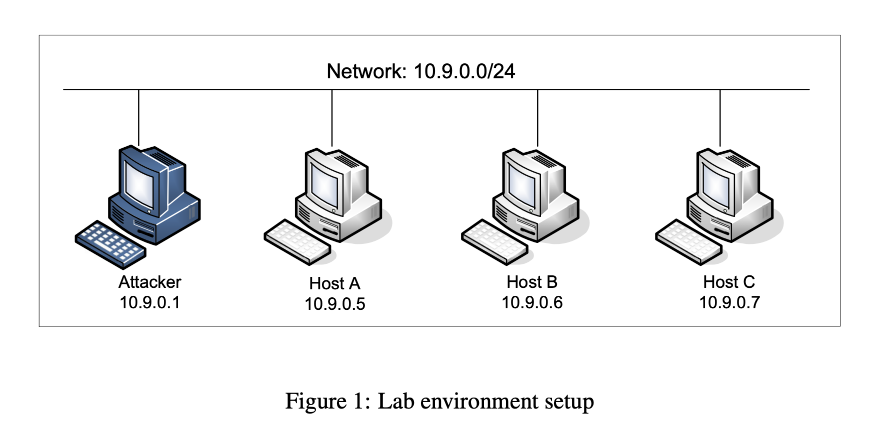
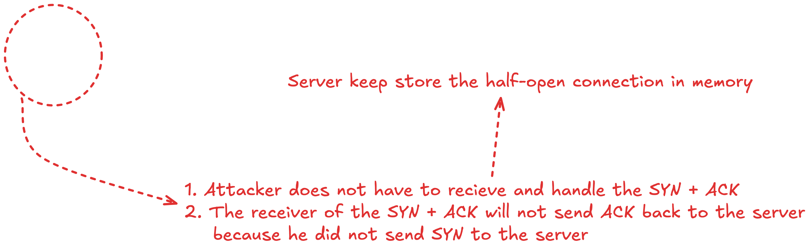

# TCP Attacks Lab

## Container Setup

The lab uses the standard OneLAN setup. We need to add the following
to the Compose file, because inside the container, we won't be able to
turn off the SYN cookie countermeasure. We only need to do this for 
the victim machine. The Compose file will be provided on the lab's website.
  ```
    HostA:
        ...
        cap_add:
                - ALL
        sysctls:
                - net.ipv4.tcp_syncookies=0
        ...         
  ```

## Lab Environment Setup 



## Task 1: SYN Flood Attack



### Related Linux kernel parameters

- `net.ipv4.tcp_max_syn_backlog`: Maximal number of remembered connection requests, which have not received an acknowledgment from connecting client. Default is 128.
- `net.ipv4.tcp_syncookies`: Send out syncookies when the syn backlog queue of a socket overflows for preventing the SYN flood attack. Default is 1.

Ref: https://sysctl-explorer.net/net/ipv4/tcp_syncookies/

### Source Code

See [Labsetup/volume/synflood.py](./Labsetup/volume/synflood.py)

### Denied of Service Attack DEMO

Watch [DEMO](./DEMO.md) to see how the SYN flood attack works.
