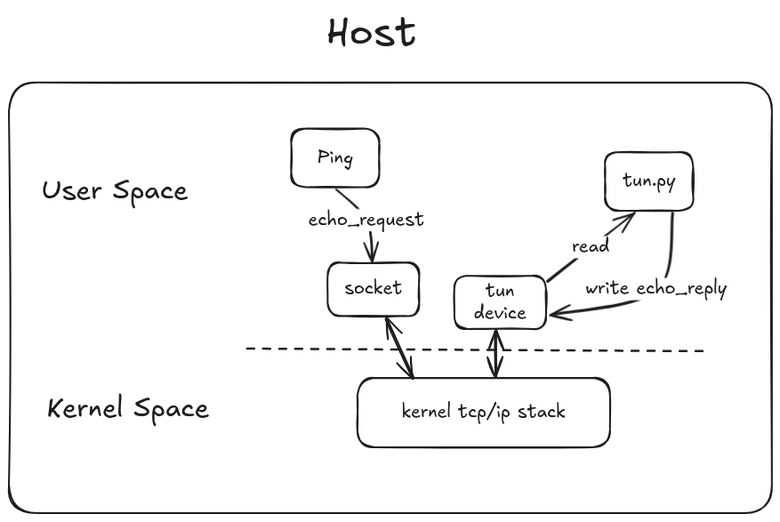
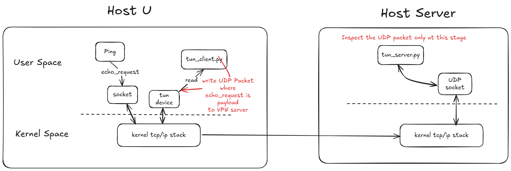
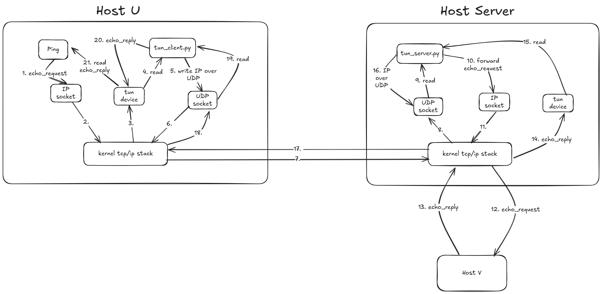

# VPN Tunneling Lab

## Related Concepts

- VPN Tunneling: create a virtual private network over a public network via tunneling protocols such as IP.
- TAP/TUN network interfaces:
    - TAP: virtual Ethernet device that operates at the link layer (Layer 2) of the OSI model. It allows user program to read and write Ethernet frames via this interface.
    - TUN: virtual network device that operates at the network layer (Layer 3) of the OSI model. It allows user program to read and write IP packets via this interface.

## Programming Variable Naming Conventions

- `IFF`: Interface Flag

## Tasks

Source code: [Labsetup/volumes/tun.py](Labsetup/volumes/tun.py)

### 1. Modify the TUN device name so that the name prefix is `tim`

Output:

```bash
tun.py
# ./tun.py
Interface Name: tim-tun0
```

### 2. Assign IP address to the TUN device and bring it up

```python
# Set the interface IP address and bring it up
os.system("ip addr add 192.168.60.99/24 dev {}".format(ifname)) # need to share the same subnet with the private network
os.system("ip link set dev {} up".format(ifname))
```

### 3. Read from the TUN device

Code snippest:

```python
while True:
    # Get a packet from the tun interface
    packet = os.read(tun, 2048)
    if packet:
        ip = IP(packet)
        print(ip.summary())
```

Ping from the tunnel client to the host from private network:

```bash
# ping 192.168.60.6
PING 192.168.60.6 (192.168.60.6) 56(84) bytes of data.
^C
--- 192.168.60.6 ping statistics ---
8 packets transmitted, 0 received, 100% packet loss, time 7167ms
```

Read from the TUN device:

```
# ./tun.py
Interface Name: tim-tun0
IP / ICMP 192.168.60.99 > 192.168.60.6 echo-request 0 / Raw
IP / ICMP 192.168.60.99 > 192.168.60.6 echo-request 0 / Raw
IP / ICMP 192.168.60.99 > 192.168.60.6 echo-request 0 / Raw
IP / ICMP 192.168.60.99 > 192.168.60.6 echo-request 0 / Raw
IP / ICMP 192.168.60.99 > 192.168.60.6 echo-request 0 / Raw
IP / ICMP 192.168.60.99 > 192.168.60.6 echo-request 0 / Raw
IP / ICMP 192.168.60.99 > 192.168.60.6 echo-request 0 / Raw
IP / ICMP 192.168.60.99 > 192.168.60.6 echo-request 0 / Raw
```

### 4. Write to the TUN device



Code snippet:

```
while True:
    # Get a packet from the tun interface
    packet = os.read(tun, 2048)
    if packet:
        ip = IP(packet)
        print(ip.summary())

        # Check if the packet is a ICMP request
        if ip.haslayer(ICMP) and ip[ICMP].type == 8:
            # Construct the ICMP reply packet: Pretend to be the destination host
            icmp_reply = IP(dst=ip.src, src=ip.dst) / ICMP(type=0, id=ip[ICMP].id, seq=ip[ICMP].seq) / Raw(load=ip[Raw].load)
            os.write(tun, bytes(icmp_reply)) # send the ICMP reply packet back to the sender
```

### 5. Send the IP Packet to VPN Server Through a Tunnel



Server Code Snippet:

```python
IP_A = "0.0.0.0"
PORT = 9090

sock = socket.socket(socket.AF_INET, socket.SOCK_DGRAM)
sock.bind((IP_A, PORT))

while True:
    data, (ip, port) = sock.recvfrom(2048)
    print("{}:{} --> {}:{}".format(ip, port, IP_A, PORT))
    pkt = IP(data)
    print("Inside: {} --> {}".format(pkt.src, pkt.dst))
```

Client Code Snippet:

```python
os.system("ip link set dev {} up".format(ifname))
os.system("ip addr add 192.168.53.99/24 dev {}".format(ifname))
os.system("ip route add 192.168.60.0/24 dev {} via 192.168.53.99".format(ifname))

sock = socket.socket(socket.AF_INET, socket.SOCK_DGRAM)

while True:
    # Get a packet from the tun interface
    packet = os.read(tun, 2048)

    # Send the packet via the tunnel
    sock.sendto(packet, (SERVER_IP, SERVER_PORT))
```

Server Output:

```bash
root@f7f5efb6e926:/volumes# ./tun_server.py
10.9.0.5:54807 --> 0.0.0.0:9090
Inside: 192.168.53.99 --> 192.168.60.5
10.9.0.5:54807 --> 0.0.0.0:9090
Inside: 192.168.53.99 --> 192.168.60.5
10.9.0.5:54807 --> 0.0.0.0:9090
Inside: 192.168.53.99 --> 192.168.60.5
10.9.0.5:54807 --> 0.0.0.0:9090
Inside: 192.168.53.99 --> 192.168.60.5
10.9.0.5:54807 --> 0.0.0.0:9090
Inside: 192.168.53.99 --> 192.168.60.5
```

### 6. Two directions VPN Tunneling



Source Codes: [Labsetup/volumes/tun_client.py](Labsetup/volumes/tun_client.py), [Labsetup/volumes/tun_server.py](Labsetup/volumes/tun_server.py)

#### DEMO

https://github.com/user-attachments/assets/7f13fe92-6091-4320-a251-2302fd49c0ca

#### Remarks

1. The VPN server host needs to enable IP forwarding to allow packets to be forwarded from host U/V to host V/U.
2. The VPN server host needs to act as the gateway for the private network. It means the VPN server host needs to have a route to the private network and the private network needs to have a route to the VPN server host.
